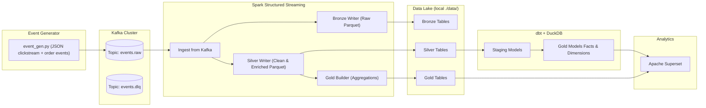

# 🛒 E-Commerce Clickstream Orders – Real-Time Data Pipeline
You’re the lone data engineer for a tiny shop. Product wants near-real-time “What’s happening right now?” plus reliable daily aggregates.

A fully containerized **real-time analytics stack** that simulates user activity and orders, ingests events via **Kafka**, processes them with **Spark Structured Streaming**, persists data in **Parquet (Bronze/Silver layers)**, and models aggregates with **dbt (DuckDB)**.  
For dashboards, it ships with **Apache Superset** pre-configured.

---

## 📐 Architecture



---

## 🗂 Data Layers

| Layer   | Description                                                                 |
|---------|-----------------------------------------------------------------------------|
| Bronze  | Raw, unmodified Kafka events stored as-is in Parquet (append-only).          |
| Silver  | Cleaned, typed, schema-enforced datasets with partitions (`event_date`).     |
| Gold    | Aggregated, business-friendly facts & dimensions (via Spark batch or dbt).   |

---

## 📦 Tech Stack

- **Kafka + Zookeeper** – event ingestion
- **Spark Structured Streaming** – real-time ETL
- **DuckDB + dbt** – modeling, transformations, semantic layer
- **Superset** – dashboards & visualizations
- **Docker Compose** – container orchestration
- **Python 3.10+** – event generator (clickstream simulator)

---

## ⚙️ Prerequisites

- Docker + Docker Compose
- Git
- Python ≥ 3.10 (for local event generator)

---

## 🚀 Quickstart

### 1️⃣ Clone Repository
```bash
git clone https://github.com/your-user/e-commerce-clickstream-orders.git
cd e-commerce-clickstream-orders
```

### 2️⃣ Start Services
```bash
docker compose up -d
```
Brings up Zookeeper, Kafka, Spark (master + worker), dbt (DuckDB), and Superset.

### 3️⃣ Verify Kafka Topics
```bash
docker compose exec kafka kafka-topics.sh --bootstrap-server kafka:9092 --list
```
Expected:
```
events.raw
events.dlq
```

### 4️⃣ Start Event Generator
```bash
cd generators
python -m venv .venv
source .venv/bin/activate        # Linux/macOS
# .\.venv\Scripts\activate       # Windows
pip install -r requirements.txt

python event_gen.py --eps 100    # events per second
```

### 5️⃣ Run Spark Streaming Job
```bash
./spark-submit.sh
```
This launches `streaming/main.py` inside the Spark container and writes **Bronze** + **Silver** data to `./data/`.

### 6️⃣ Explore Data
Check partitions written:
```bash
ls data/bronze/events/event_date=$(date +%Y-%m-%d)
ls data/silver/page_view/
```

### 7️⃣ Build dbt Models (Optional Gold Layer)
```bash
docker compose exec dbt bash -lc "
  dbt seed
  dbt run
  dbt test
"
```
This materializes **staging** + **gold** models into `dbt/warehouse.duckdb`.

### 8️⃣ Visualize in Superset
Open: [http://localhost:8088](http://localhost:8088)  
Login: `admin / admin`

---

## 📁 Project Structure

```
e-commerce-clickstream-orders/
│
├── docker-compose.yml        # Orchestration of all services
├── spark-submit.sh           # Helper to run Spark job
├── README.md                 # This file
│
├── generators/               # Event simulator
│   └── event_gen.py
│
├── streaming/                # PySpark Structured Streaming jobs
│   ├── main.py               # Bronze/Silver writer
│   ├── gold.py               # Daily aggregates
│   └── read_console.py       # Debug Kafka console
│
├── dbt/                      # dbt project (DuckDB)
│   ├── dbt_project.yml
│   ├── models/
│   │   ├── staging/          # stg_sessions, stg_page_view, ...
│   │   └── gold/             # fct_orders, daily_funnel, dim_user, ...
│   └── seeds/                # dim_sku.csv, dim_user.csv
│
├── data/                     # Local data lake (Parquet)
│   ├── bronze/
│   ├── silver/
│   └── gold/
│
└── superset/                 # Superset metadata, DuckDB driver
```

---

## 📊 Gold Models (via dbt)

| Model                     | Purpose                                               |
|----------------------------|-------------------------------------------------------|
| `fct_orders.sql`           | Daily order counts + revenue                          |
| `fct_sessions.sql`         | User sessions (page views, conversions)               |
| `fct_revenue_daily.sql`    | Revenue and units sold by day                         |
| `fct_revenue_by_category`  | Daily revenue split by SKU category                   |
| `dim_user.sql`             | User lifetime stats (sessions, orders, LTV)           |
| `dim_sku_360.sql`          | Product catalog joined with sales & cart behaviors    |
| `daily_funnel.sql`         | View-to-Cart-to-Order funnel with conversion rates    |

---

## 📊 Monitoring

| Component        | URL                                   |
|------------------|---------------------------------------|
| Kafka UI         | [http://localhost:8080](http://localhost:8080) |
| Spark Master UI  | [http://localhost:8081](http://localhost:8081) |
| Spark Worker UI  | [http://localhost:8082](http://localhost:8082) |
| Superset         | [http://localhost:8088](http://localhost:8088) |

---

## 🛠 Troubleshooting

| Issue                                   | Cause                                 | Fix |
|----------------------------------------|---------------------------------------|-----|
| `Initial job has not accepted any resources` | Spark workers not registered        | Check Spark UI; restart workers |
| Empty Bronze/Silver folders             | Event generator not running           | Start `event_gen.py` before Spark job |
| `Permission denied` writing to `/opt/data` | Docker volume ownership issue        | Run containers with `user: "0:0"` |
| dbt errors on `dim_user`                | Name collision (seed vs. model)       | Rename one of them (`dim_user_seed.csv`) |

---

## 📈 Next Steps

- Extend **event generator** with richer user behavior (multi-session, returns, etc.)
- Add **Gold metrics** like DAU/WAU/MAU, cohort analysis
- Deploy on **cloud infra** (MSK/Kinesis + EMR/Databricks + S3/ADLS)
- Secure **Superset** with external auth

---

## 📜 License
MIT – see [LICENSE](LICENSE)
